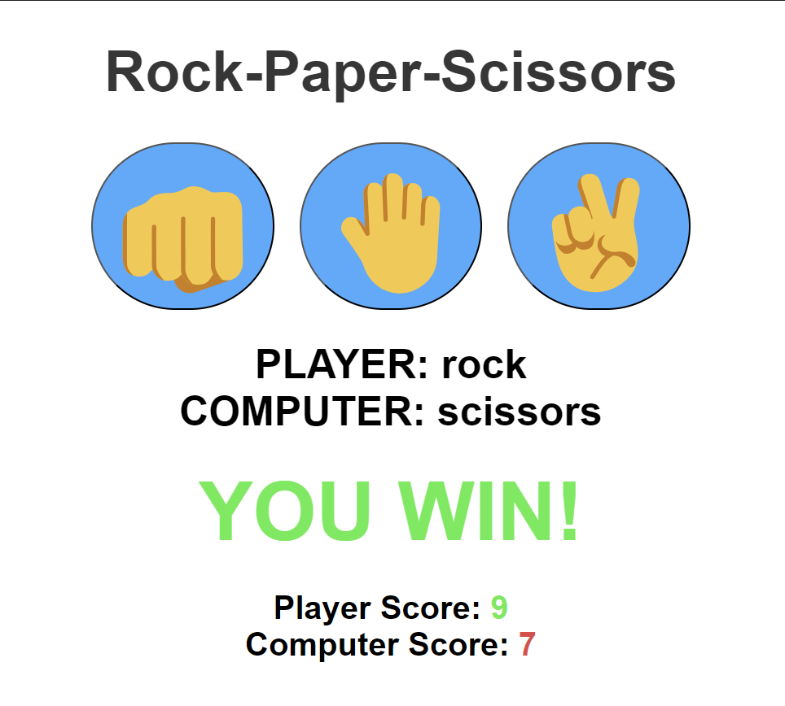

<h1>Rock-Paper-Scissors Game👊🤚✌️</h1>

Developed the classic game of Rock, Paper, Scissors!  Users can test their luck against a computer opponent.

<h3>Features:</h3>
<ul>
<li>Play the classic Rock, Paper, Scissors game.</li>
<li>Compete against a computer opponent.</li>
<li>Simple and user-friendly interface.</li>
</ul>

<h3>How to Play:</h3>
<ol>
<li>Clone or download the repository.</li>
<li>Run the program</li>
<li>Choose your move: Rock, Paper, or Scissors.</li>
<li>The computer will make its choice.</li>
</ol>
<h4>The winner will be declared based on the classic Rock-Paper-Scissors rules.</h4>
